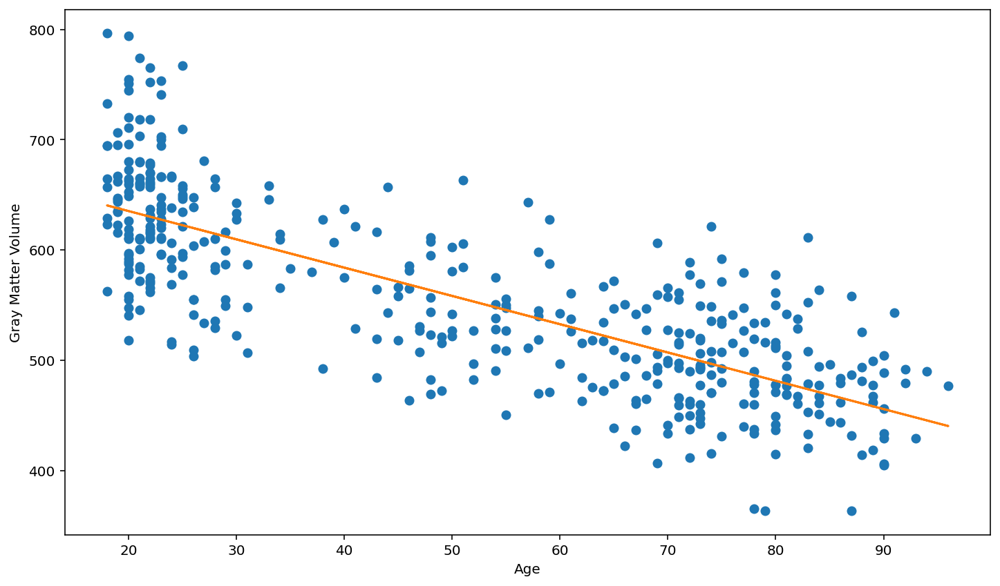

# Age and Gray Matter #

This is the full workflow of the project that I created to look at the relationship between age and gray matter volume.


```python
import numpy as np
import pandas as pd
import matplotlib.pyplot as plt
```


```python
df= pd.read_csv('oasis_all_volumes.csv')
```


```python
df
```


<table border="1" class="dataframe">
  <thead>
    <tr style="text-align: right;">
      <th></th>
      <th>ID</th>
      <th>age</th>
      <th>sex</th>
      <th>alzheimers</th>
      <th>brain_vol</th>
      <th>skull_vol</th>
      <th>gray_matter_vol</th>
      <th>white_matter_vol</th>
      <th>csf_vol</th>
    </tr>
  </thead>
  <tbody>
    <tr>
      <th>0</th>
      <td>OAS1_0001_MR1</td>
      <td>74</td>
      <td>F</td>
      <td>False</td>
      <td>807.935</td>
      <td>1347.497879</td>
      <td>470.698</td>
      <td>337.237</td>
      <td>57.058</td>
    </tr>
    <tr>
      <th>1</th>
      <td>OAS1_0002_MR1</td>
      <td>55</td>
      <td>F</td>
      <td>False</td>
      <td>808.760</td>
      <td>1151.269287</td>
      <td>450.571</td>
      <td>358.189</td>
      <td>9.478</td>
    </tr>
    <tr>
      <th>2</th>
      <td>OAS1_0003_MR1</td>
      <td>73</td>
      <td>F</td>
      <td>True</td>
      <td>860.255</td>
      <td>1403.415054</td>
      <td>492.974</td>
      <td>367.281</td>
      <td>46.159</td>
    </tr>
    <tr>
      <th>3</th>
      <td>OAS1_0004_MR1</td>
      <td>28</td>
      <td>M</td>
      <td>False</td>
      <td>1058.202</td>
      <td>1593.284910</td>
      <td>585.270</td>
      <td>472.932</td>
      <td>32.609</td>
    </tr>
    <tr>
      <th>4</th>
      <td>OAS1_0005_MR1</td>
      <td>18</td>
      <td>M</td>
      <td>False</td>
      <td>1263.391</td>
      <td>1733.779281</td>
      <td>732.734</td>
      <td>530.657</td>
      <td>14.887</td>
    </tr>
    <tr>
      <th>...</th>
      <td>...</td>
      <td>...</td>
      <td>...</td>
      <td>...</td>
      <td>...</td>
      <td>...</td>
      <td>...</td>
      <td>...</td>
      <td>...</td>
    </tr>
    <tr>
      <th>420</th>
      <td>OAS1_0285_MR2</td>
      <td>20</td>
      <td>M</td>
      <td>False</td>
      <td>1091.830</td>
      <td>1415.806598</td>
      <td>672.856</td>
      <td>418.974</td>
      <td>13.205</td>
    </tr>
    <tr>
      <th>421</th>
      <td>OAS1_0353_MR2</td>
      <td>22</td>
      <td>M</td>
      <td>False</td>
      <td>1143.419</td>
      <td>1626.774063</td>
      <td>636.923</td>
      <td>506.496</td>
      <td>25.213</td>
    </tr>
    <tr>
      <th>422</th>
      <td>OAS1_0368_MR2</td>
      <td>22</td>
      <td>M</td>
      <td>False</td>
      <td>1144.976</td>
      <td>1720.021652</td>
      <td>656.775</td>
      <td>488.201</td>
      <td>15.812</td>
    </tr>
    <tr>
      <th>423</th>
      <td>OAS1_0379_MR2</td>
      <td>20</td>
      <td>F</td>
      <td>False</td>
      <td>956.220</td>
      <td>1346.932214</td>
      <td>540.561</td>
      <td>415.659</td>
      <td>13.807</td>
    </tr>
    <tr>
      <th>424</th>
      <td>OAS1_0395_MR2</td>
      <td>26</td>
      <td>F</td>
      <td>False</td>
      <td>959.715</td>
      <td>1284.066201</td>
      <td>554.701</td>
      <td>405.014</td>
      <td>9.144</td>
    </tr>
  </tbody>
</table>
</div>


## Filtered Dataframe to Age and Gray Matter ##


```python
df[['age','gray_matter_vol']]
```


<table border="1" class="dataframe">
  <thead>
    <tr style="text-align: right;">
      <th></th>
      <th>age</th>
      <th>gray_matter_vol</th>
    </tr>
  </thead>
  <tbody>
    <tr>
      <th>0</th>
      <td>74</td>
      <td>470.698</td>
    </tr>
    <tr>
      <th>1</th>
      <td>55</td>
      <td>450.571</td>
    </tr>
    <tr>
      <th>2</th>
      <td>73</td>
      <td>492.974</td>
    </tr>
    <tr>
      <th>3</th>
      <td>28</td>
      <td>585.270</td>
    </tr>
    <tr>
      <th>4</th>
      <td>18</td>
      <td>732.734</td>
    </tr>
    <tr>
      <th>...</th>
      <td>...</td>
      <td>...</td>
    </tr>
    <tr>
      <th>420</th>
      <td>20</td>
      <td>672.856</td>
    </tr>
    <tr>
      <th>421</th>
      <td>22</td>
      <td>636.923</td>
    </tr>
    <tr>
      <th>422</th>
      <td>22</td>
      <td>656.775</td>
    </tr>
    <tr>
      <th>423</th>
      <td>20</td>
      <td>540.561</td>
    </tr>
    <tr>
      <th>424</th>
      <td>26</td>
      <td>554.701</td>
    </tr>
  </tbody>
</table>
</div>


```python
# df containing age and gray matter volume
df_age_grey= df[['age','gray_matter_vol']]
```

## Create NumPy arrays for the age column and the gray matter column


```python
# np array: age
np_age = np.array(df['age'])
```


```python
# np array: gray matter volume
np_gmv = np.array(df['gray_matter_vol'])
```

## Linear regression of age and gray matter volume to explore relationship


```python
# linear regression: age and gray matter volume
plt.plot(np_age, np_gmv, 'o')

m, b = np.polyfit(np_age, np_gmv, 1)

plt.plot(np_age, m*np_age + b)

plt.xlabel('Age')
plt.ylabel('Gray Matter Volume')
```


   





## Inital thoughts about relationship

The plot above shows that there appears to be a trend that gray matter volume tends to decrease as age increases. 

## Checking oldest and youngest participant ages


```python
# youngest participant
min(df_age_grey['age'])
```


    18


```python
# oldest participant
max(df_age_grey['age'])
```


    96


## Grouping participants into age categories and finding the means


```python
# participants min-24
df_age_grey[df_age_grey['age'] <= 24]

#mean
ag_mean_min24= df_age_grey[df_age_grey['age'] <= 24].mean()
```


```python
# participants 25-34
df_age_grey[(df_age_grey['age'] >= 25) & (df_age_grey['age'] <= 34)]

#mean
ag_mean_2534= df_age_grey[(df_age_grey['age'] >= 25) & (df_age_grey['age'] <= 34)].mean()
```


```python
# participants 35-44
df_age_grey[(df_age_grey['age'] >= 35) & (df_age_grey['age'] <= 44)]

#mean
ag_mean_3544= df_age_grey[(df_age_grey['age'] >= 35) & (df_age_grey['age'] <= 44)].mean()
```


```python
# participants 45-54
df_age_grey[(df_age_grey['age'] >= 45) & (df_age_grey['age'] <= 54)]

#mean
ag_mean_4554= df_age_grey[(df_age_grey['age'] >= 45) & (df_age_grey['age'] <= 54)].mean()
```


```python
# particpants 55-64
df_age_grey[(df_age_grey['age'] >= 55) & (df_age_grey['age'] <= 64)]

#mean
ag_mean_5564= df_age_grey[(df_age_grey['age'] >= 55) & (df_age_grey['age'] <= 64)].mean()
```


```python
# particpants 65-74
df_age_grey[(df_age_grey['age'] >= 65) & (df_age_grey['age'] <= 74)]

#mean
ag_mean_6574= df_age_grey[(df_age_grey['age'] >= 65) & (df_age_grey['age'] <= 74)].mean()
```


```python
# particpants 75-84
df_age_grey[(df_age_grey['age'] >= 75) & (df_age_grey['age'] <= 84)]

#mean
ag_mean_7584= df_age_grey[(df_age_grey['age'] >= 75) & (df_age_grey['age'] <= 84)].mean()
```


```python
# particpants 85-94
df_age_grey[(df_age_grey['age'] >= 85) & (df_age_grey['age'] <= 94)]

#mean
ag_mean_8594= df_age_grey[(df_age_grey['age'] >= 85) & (df_age_grey['age'] <= 94)].mean()
```


```python
# particpants 95-max
df_age_grey[(df_age_grey['age'] >= 95)]

#mean
ag_mean_95max= df_age_grey[(df_age_grey['age'] >= 95)].mean()
```

## Creating age and gray matter mean lists


```python
#mean age list
age_mean_list = [ag_mean_min24['age'], ag_mean_2534['age'], ag_mean_3544['age'], ag_mean_4554['age'], ag_mean_5564['age'], ag_mean_6574['age'], ag_mean_7584['age'], ag_mean_8594['age'], ag_mean_95max['age']]

#mean grey matter volume
gm_mean_list = [ag_mean_min24['gray_matter_vol'], ag_mean_2534['gray_matter_vol'], ag_mean_3544['gray_matter_vol'], ag_mean_4554['gray_matter_vol'], ag_mean_5564['gray_matter_vol'], ag_mean_6574['gray_matter_vol'], ag_mean_7584['gray_matter_vol'], ag_mean_8594['gray_matter_vol'], ag_mean_95max['gray_matter_vol']]

```

## Creating a new dataframe to showcase means


```python
data = {'Age': ['=< 24', '25-34', '35-44', '45-54', '55-64', '65-74', '75-84', '85-94', '95 =<' ],
       'Mean Age': age_mean_list,
       'Mean Gray Matter Volume':gm_mean_list}

df_ag_mean= pd.DataFrame(data)
```


```python
df_ag_mean
```


<table border="1" class="dataframe">
  <thead>
    <tr style="text-align: right;">
      <th></th>
      <th>Age</th>
      <th>Mean Age</th>
      <th>Mean Gray Matter Volume</th>
    </tr>
  </thead>
  <tbody>
    <tr>
      <th>0</th>
      <td>=&lt; 24</td>
      <td>21.066667</td>
      <td>641.716458</td>
    </tr>
    <tr>
      <th>1</th>
      <td>25-34</td>
      <td>27.893617</td>
      <td>603.565191</td>
    </tr>
    <tr>
      <th>2</th>
      <td>35-44</td>
      <td>40.600000</td>
      <td>575.753533</td>
    </tr>
    <tr>
      <th>3</th>
      <td>45-54</td>
      <td>49.315789</td>
      <td>542.800289</td>
    </tr>
    <tr>
      <th>4</th>
      <td>55-64</td>
      <td>59.548387</td>
      <td>526.929806</td>
    </tr>
    <tr>
      <th>5</th>
      <td>65-74</td>
      <td>70.480000</td>
      <td>498.318000</td>
    </tr>
    <tr>
      <th>6</th>
      <td>75-84</td>
      <td>79.582090</td>
      <td>493.017164</td>
    </tr>
    <tr>
      <th>7</th>
      <td>85-94</td>
      <td>88.741935</td>
      <td>465.930000</td>
    </tr>
    <tr>
      <th>8</th>
      <td>95 =&lt;</td>
      <td>96.000000</td>
      <td>476.571000</td>
    </tr>
  </tbody>
</table>
</div>


## Finals thought about the relationship between age and gray matter volume

From looking at the gray matter volume means we can see that there is a steady decrease in volume as move from the younger categories to the older categories with the one excpetion  seen in the 95 < category. Through out the process of getting to the mean values, it was discovered that there is only one partcipant in the 95 < categories which throws off the linear relationship. The means support what was seen at the beginning in the linear regression plot. 


```python

```
