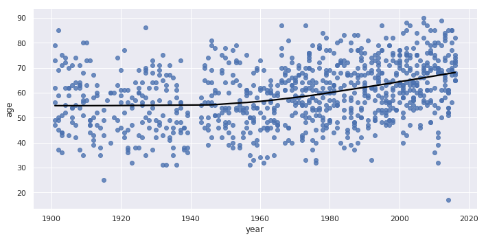

This sample of code showases the use of seaborn to create a scatter plot. The trendline shows the relationship between age of the recipiant and the year they recieved their Nobel Prize. 


```python
# Converting birth_date from String to datetime
nobel['birth_date'] = pd.to_datetime(nobel['birth_date'])

# Calculating the age of Nobel Prize winners
nobel['age'] = nobel['year'] - nobel['birth_date'].dt.year

# Plotting the age of Nobel Prize winners
sns.lmplot(x='year', y='age', data=nobel, lowess=True, 
           aspect=2, line_kws={'color' : 'black'})
```


  





