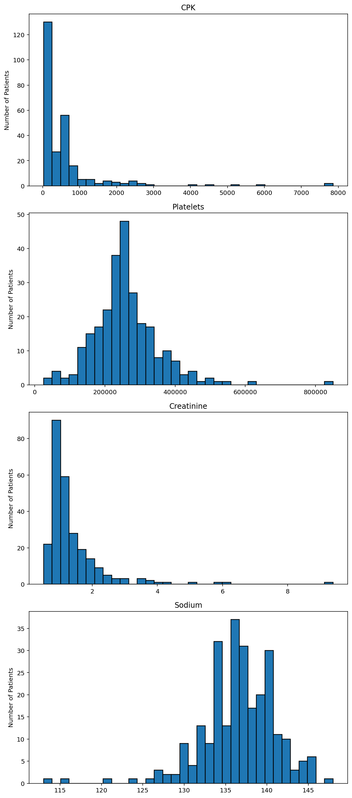

# Exploring Different Concentration Levels Using a For Loop #

This sample shows how a for loop was used to create multiple plots to explore the distribution of data between the concentration levels of different biological markers related to heart failure.


```python
df[conditions[0]]
```


<table border="1" class="dataframe">
  <thead>
    <tr style="text-align: right;">
      <th></th>
      <th>age</th>
      <th>anaemia</th>
      <th>creatinine_phosphokinase</th>
      <th>diabetes</th>
      <th>ejection_fraction</th>
      <th>high_blood_pressure</th>
      <th>platelets</th>
      <th>serum_creatinine</th>
      <th>serum_sodium</th>
      <th>sex</th>
      <th>smoking</th>
      <th>time</th>
      <th>DEATH_EVENT</th>
    </tr>
  </thead>
  <tbody>
    <tr>
      <th>0</th>
      <td>75.0</td>
      <td>0</td>
      <td>582</td>
      <td>0</td>
      <td>20</td>
      <td>1</td>
      <td>265000.00</td>
      <td>1.9</td>
      <td>130</td>
      <td>1</td>
      <td>0</td>
      <td>4</td>
      <td>1</td>
    </tr>
    <tr>
      <th>1</th>
      <td>55.0</td>
      <td>0</td>
      <td>7861</td>
      <td>0</td>
      <td>38</td>
      <td>0</td>
      <td>263358.03</td>
      <td>1.1</td>
      <td>136</td>
      <td>1</td>
      <td>0</td>
      <td>6</td>
      <td>1</td>
    </tr>
    <tr>
      <th>2</th>
      <td>65.0</td>
      <td>0</td>
      <td>146</td>
      <td>0</td>
      <td>20</td>
      <td>0</td>
      <td>162000.00</td>
      <td>1.3</td>
      <td>129</td>
      <td>1</td>
      <td>1</td>
      <td>7</td>
      <td>1</td>
    </tr>
    <tr>
      <th>3</th>
      <td>50.0</td>
      <td>1</td>
      <td>111</td>
      <td>0</td>
      <td>20</td>
      <td>0</td>
      <td>210000.00</td>
      <td>1.9</td>
      <td>137</td>
      <td>1</td>
      <td>0</td>
      <td>7</td>
      <td>1</td>
    </tr>
    <tr>
      <th>4</th>
      <td>65.0</td>
      <td>1</td>
      <td>160</td>
      <td>1</td>
      <td>20</td>
      <td>0</td>
      <td>327000.00</td>
      <td>2.7</td>
      <td>116</td>
      <td>0</td>
      <td>0</td>
      <td>8</td>
      <td>1</td>
    </tr>
    <tr>
      <th>...</th>
      <td>...</td>
      <td>...</td>
      <td>...</td>
      <td>...</td>
      <td>...</td>
      <td>...</td>
      <td>...</td>
      <td>...</td>
      <td>...</td>
      <td>...</td>
      <td>...</td>
      <td>...</td>
      <td>...</td>
    </tr>
    <tr>
      <th>293</th>
      <td>63.0</td>
      <td>1</td>
      <td>103</td>
      <td>1</td>
      <td>35</td>
      <td>0</td>
      <td>179000.00</td>
      <td>0.9</td>
      <td>136</td>
      <td>1</td>
      <td>1</td>
      <td>270</td>
      <td>0</td>
    </tr>
    <tr>
      <th>294</th>
      <td>62.0</td>
      <td>0</td>
      <td>61</td>
      <td>1</td>
      <td>38</td>
      <td>1</td>
      <td>155000.00</td>
      <td>1.1</td>
      <td>143</td>
      <td>1</td>
      <td>1</td>
      <td>270</td>
      <td>0</td>
    </tr>
    <tr>
      <th>295</th>
      <td>55.0</td>
      <td>0</td>
      <td>1820</td>
      <td>0</td>
      <td>38</td>
      <td>0</td>
      <td>270000.00</td>
      <td>1.2</td>
      <td>139</td>
      <td>0</td>
      <td>0</td>
      <td>271</td>
      <td>0</td>
    </tr>
    <tr>
      <th>297</th>
      <td>45.0</td>
      <td>0</td>
      <td>2413</td>
      <td>0</td>
      <td>38</td>
      <td>0</td>
      <td>140000.00</td>
      <td>1.4</td>
      <td>140</td>
      <td>1</td>
      <td>1</td>
      <td>280</td>
      <td>0</td>
    </tr>
    <tr>
      <th>298</th>
      <td>50.0</td>
      <td>0</td>
      <td>196</td>
      <td>0</td>
      <td>45</td>
      <td>0</td>
      <td>395000.00</td>
      <td>1.6</td>
      <td>136</td>
      <td>1</td>
      <td>1</td>
      <td>285</td>
      <td>0</td>
    </tr>
  </tbody>
</table>
<p>263 rows × 13 columns</p>


```python
df_ab= df[conditions[0]]
```


```python
# Levels Dictionary
levels = {'CPK': df_ab['creatinine_phosphokinase'], 'Platelets': df_ab['platelets'], 'Creatinine': df_ab['serum_creatinine'], 'Sodium': df_ab['serum_sodium']}
```


```python
# Exploratory Plots of Levels
fig= plt.figure(figsize=[8,18])

subplot_counter= 1
for l in levels:
    ax = fig.add_subplot(len(levels), 1, subplot_counter)
    ax.hist(levels[l], bins=34,edgecolor='black', linewidth=1.2, align= 'mid')
    plt.ylabel('Number of Patients')
    plt.title(l) 
    plt.tight_layout()
   
    subplot_counter += 1
    
plt.show()
```





